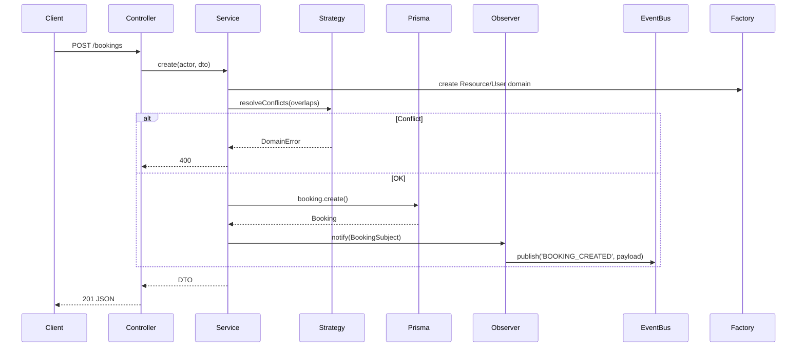
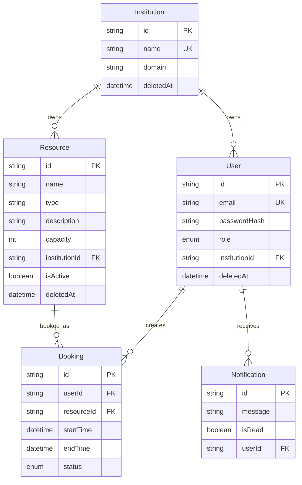
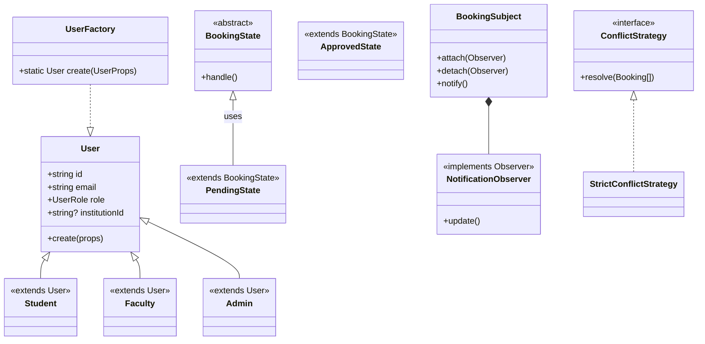

# Campus Resource Management System (CRMS) Documentation

## Overview
CRMS is a full-stack, multi-tenant application for managing campus resource bookings (e.g., classrooms, labs, auditoriums). It supports role-based access (STUDENT, FACULTY, ADMIN, SUPER_ADMIN), booking workflows with approval/rejection/cancellation, conflict resolution, event-driven notifications, and a dashboard-based UI.

**Key Features**:
- Multi-tenancy: Institutions (universities) own users/resources.
- Secure auth (JWT, bcrypt, role guards).
- REST API with Swagger docs.
- Prisma ORM for PostgreSQL with migrations/soft-deletes.
- Event-driven notifications (EventBus pattern).
- Booking conflict strategies.
- Frontend dashboard with booking/resource/user management UI.
- Role-based access control (STUDENT, FACULTY, ADMIN, SUPER_ADMIN).

## Tech Stack
### Backend
- **Runtime**: Node.js, Express 5, TypeScript
- **Database**: PostgreSQL via Prisma 6
- **Auth**: JWT 9, bcryptjs
- **Security**: helmet, cors, express-rate-limit
- **Real-time**: Socket.io 4 (placeholder — not currently wired)
- **Docs**: Swagger-jsdoc, redoc-express
- **Dev**: nodemon, ts-node

### Frontend
- **Framework**: Next.js 16 (App Router), React 19, TypeScript
- **Styling**: TailwindCSS 4, PostCSS
- **UI**: Custom dashboard components (FullCalendar 6 installed but not actively used)
- **Networking**: Axios, Socket.io-client 4 (placeholder)
- **Linting**: ESLint 9, eslint-config-next

## Architecture
Clean Architecture / Layered / DDD-inspired:
- **Controllers**: Handle HTTP req/res (e.g., UserController, BookingController).
- **Routes**: Express routers (auth.routes.ts, booking.routes.ts).
- **Services**: Business logic (UserService calls domain models/validators).
- **Models**: Domain entities (User subclasses via Factory).
- **Mappers**: Domain <-> DTO conversions.
- **Middleware**: Auth, validation, etc.
- **Shared**: Errors (DomainError), Types.
**EventBus**: In-memory pub/sub for notifications and booking lifecycle events.
- **patterns/**: Explicit GoF implementations.

## Backend Infrastructure Deep Dive
### How Backend Works (Request Flow)
1. **Entry**: Express app (`server.ts`) mounts routes/middleware/Swagger. `src/app.ts` registers event handlers.
2. **Middleware Pipeline**: CORS, rate-limit, helmet, auth (JWT verify + role/institution scope).
3. **Routing**: `/api/v1/[auth|users|resources|bookings|institutions]` -> controller methods.
4. **Controller -> Service**: Extract actor (req.user), call service (e.g., `bookingService.create(actor, dto)`).
5. **Service -> Domain**: Validate, use Factory/State/Strategy, map DTO->domain, persist via Prisma.
6. **Domain -> Prisma**: Repos/services query with tenant filter (`where: {institutionId, deletedAt: null}`).
7. **Post-persist**: Observer notify -> EventBus publish -> Log/Notification handlers.
8. **Error Handling**: DomainError -> standardized JSON error response.

**Sequence Diagram: Create Booking**


### Detailed API Endpoints (Controllers)
| Method | Endpoint | Controller | Description | Auth/Role |
|--------|----------|------------|-------------|-----------|
| POST | /auth/login | AuthController | JWT token | public |
| GET | /users | UserController | List institution users | institution admin+ |
| PATCH | /users/:id | UserController | Update role | superadmin/admin |
| DELETE | /users/:id | UserController | Soft delete | admin+ |
| POST | /bookings | BookingController | Create booking | institution user |
| PATCH | /bookings/:id/approve | BookingController | Approve (state trans) | faculty+ |
| PATCH | /bookings/:id/reject | BookingController | Reject | faculty+ |
| PATCH | /bookings/:id/cancel | BookingController | Cancel | owner |
| GET | /resources | ResourceController | List available | user |
| POST | /resources | ResourceController | Create resource | admin |
| POST | /institutions | InstitutionController | Create institution | superadmin |

**Proceed with Development**:
- **Extend Booking**: Add to BookingService, controller/route method, Prisma field, State transition.
- **New Endpoint**: Add controller method, route file `new.routes.ts`, mount in `server.ts`.
- **Custom Validation**: Domain model method or Factory.
- **Prisma Changes**: `schema.prisma` -> `npx prisma generate migrate dev`.
- **EventBus Events**: Extend handlers in `src/events/handlers/` and register in `src/app.ts`.
- **Testing**: Unit (services/domain), E2E (supertest + prisma mock).

### Prisma Integration
- Tenant-aware: Services append `{institutionId: actor.institutionId!, deletedAt: null}`.
- Relations: Eager-load (`include: {user: true, resource: true}`) to avoid N+1.
- Indexes (recommended): Composite on `institutionId + deletedAt`, `resourceId + startTime`.


## Design Patterns
Explicit implementations in `backend/src/patterns/`:

1. **Factory Method** (`factory/UserFactory.ts`):
   - Creates User subclasses (Student, Faculty, Admin) based on role.
   - Validates props, handles polymorphism.

2. **Observer** (`observer/`):
   - `BookingSubject.ts`: Subject for booking state changes.
   - `NotificationObserver.ts`: Observer for notifications.

3. **State** (`state/`):
   - `BookingState.ts`: Abstract base.
   - Concrete: `PendingState.ts`, `ApprovedState.ts`, `RejectedState.ts`, `CancelledState.ts`.
   - Encapsulates booking lifecycle transitions.

4. **Strategy** (`strategy/`):
   - Conflict resolution for overlapping bookings.
   - `StrictConflictStrategy.ts`, `PriorityConflictStrategy.ts`, `ConflictStrategy.ts`.

**Other Patterns**:
- **Repository** (implicit via Prisma).
- **DTO** (mappers).
- **MVC** (controllers/routes/services).
- **Singleton/Dependency Injection** (services instantiated in controllers).
- **Command** (booking create/approve/reject).

## Database Schema (ER Diagram)


**Enums**:
- `Role`: STUDENT, FACULTY, ADMIN, SUPER_ADMIN
- `BookingStatus`: PENDING, APPROVED, REJECTED, CANCELLED

## Class Diagram (Key Domain Classes)


## API Endpoints (Inferred from Controllers/Routes)
- **Users**: GET /users (institution), PATCH /users/:id, DELETE /users/:id (soft).
- **Bookings**: POST /bookings, PATCH /bookings/:id/approve|reject|cancel.
- **Resources**: CRUD for institution resources.
- **Institutions**: Create/manage.
- EventBus: Pub/sub events for notifications and booking lifecycle.

## Frontend Structure
Next.js App Router:
- `src/app/layout.tsx`: Root layout (dark mode, CSS variables).
- `src/app/page.tsx`: Redirects to `/login`.
- `(auth)/login|register`: Auth pages.
- `(dashboard)/bookings|calendar|resources|users|institutions`: Protected dashboard pages. (Note: calendar currently redirects to `/bookings`.)

## Key Technical Details
- **Multi-tenancy**: All queries scoped by `institutionId` from JWT.
- **Security**: Role guards in middleware/services, rate-limiting, helmet.
- **Error Handling**: DomainError for business rules.
- **Validation**: Factory/service level.
- **Soft Deletes**: `deletedAt` timestamps.
- **Dev Workflow**: `npm run dev` (backend: nodemon ts-node server.ts; frontend: next dev).

## Potential User Questions (FAQ)
### Basic Setup & Usage
1. **How to setup the project locally?**
   - Backend: `cd backend && npm i`, setup `.env` with `DATABASE_URL`, `npx prisma generate && npx prisma migrate dev`, `npm run dev`.
   - Frontend: `cd frontend && npm i`, `npm run dev`.


2. **How to add a new user role (e.g., MAINTENANCE)?**
   - Add to Prisma `Role` enum.
   - Create `Maintenance.ts` model extending User.
   - Add case in `UserFactory.create()` switch.
   - Update role guards in middleware/services.

3. **How do booking conflicts get resolved?**
   - Service layer uses Strategy pattern (`PriorityConflictStrategy` etc.) to detect overlaps via Prisma queries.
   - Throws `DomainError` if unresolved; configurable per institution/role.

4. **How do notifications work?**
   - Observer: `BookingSubject.notify()` triggers `NotificationObserver` on state changes.
   - EventBus publishes events (`BOOKING_CREATED`, `BOOKING_APPROVED`, etc.) to registered handlers (LogHandler, NotificationHandler).

### Advanced Technical Questions & Tradeoffs
11. **Why Prisma over raw SQL/Sequelize? Tradeoffs?**
    - **Pros**: Type-safe queries, migrations auto, schema-first (great for TS).
    - **Cons**: N+1 perf issues (use `include/select`), less control over complex joins, migration lock-in.
    - Mitigation: Raw queries for perf-critical (e.g., booking overlaps).

12. **Clean Architecture worth the folder complexity?**
    - **Pros**: Testable, decoupled (services pure), scalable for teams.
    - **Cons**: Boilerplate (mappers/DTOs), overkill for small apps, learning curve.
    - Here: Justified by patterns/multi-tenancy.

13. **State pattern for bookings: Benefits vs simple enum?**
    - **Pros**: Encapsulates transitions (e.g., PENDING->APPROVED only), extensible.
    - **Cons**: More classes/files vs enum if-checks.
    - Tradeoff: Maintainability wins for complex workflows.

14. **Multi-tenancy via institutionId filtering: Secure/scalable?**
    - **Pros**: Single DB (cost-effective), row-level isolation.
    - **Cons**: Accidental data leaks if filter missed, perf (index on institutionId).
    - Alt: Schema-per-tenant (complex), DB-per-tenant (expensive).
    - Enforced in services/middleware.

15. **Socket.io vs Server-Sent Events/polling for notifications?**
    - **Pros**: Bidirectional, rooms (per institution), fallback transports.
    - **Cons**: WebSocket overhead, scaling (Redis adapter needed for prod).
    - Here: Socket.io is installed as a placeholder; currently EventBus handles notifications server-side. WebSocket delivery can be wired later.

16. **Next.js App Router vs Pages Router?**
    - **Pros**: File-based routing, React Server Components (perf), colocation.
    - **Cons**: Breaking changes, Server Actions learning curve.
    - Tradeoff: Future-proof, but migrate carefully.

17. **FullCalendar: Status and limitations?**
    - **Status**: Installed but not currently active (calendar page redirects to `/bookings`).
    - **Pros**: Rich views (timegrid), React integration, customizable.
    - **Cons**: Client-side (no SSR events), paid for advanced (recurring).
    - Alt: Custom with shadcn/ui + react-big-calendar.

18. **TypeScript strict mode? Enforced?**
    - Pros: Catches domain errors early (e.g., role enums).
    - Cons: Verbose (mappers for Prisma raw types).
    - Config: tsconfig strict: true recommended.

19. **Soft deletes: Pros/Cons vs hard delete?**
    - **Pros**: Audit trail, undo possible, GDPR compliance.
    - **Cons**: DB bloat, perf (index on deletedAt), query complexity (`deletedAt IS NULL`).
    - Here: Scoped in Prisma relations.

20. **Scaling API: Monolith ok? Microservices?**
    - Current: Fine for campus (rate-limit helps).
    - Tradeoff: Microservices (per institution?) add service mesh complexity; stick to monolith + horizontal scale.

## Files Structure
```
CRMS/
├── backend/
│   ├── prisma/schema.prisma (ER)
│   ├── server.ts (Express entry)
│   ├── src/
│   │   ├── app.ts (event handler registration)
│   │   ├── config/ (env, db)
│   │   ├── controllers/*.ts (5 files)
│   │   ├── docs/ (swagger, redoc)
│   │   ├── events/ (EventBus, handlers)
│   │   ├── middleware/ (auth, rate limit, validation, role guards)
│   │   ├── mappers/ (UserMapper, InstitutionMapper)
│   │   ├── models/ (User, Booking, Resource, etc.)
│   │   ├── routes/*.ts (5 files)
│   │   ├── services/ (business logic)
│   │   ├── shared/ (DomainError, query helpers, response, type guards)
│   │   ├── types/ (bcrypt.d.ts)
│   │   ├── validators/ (Zod schemas)
│   │   └── patterns/ (factory/observer/state/strategy)
│   └── socket/ (placeholder)
├── frontend/
│   ├── src/
│   │   ├── app/
│   │   │   ├── layout.tsx, page.tsx
│   │   │   ├── (auth)/login|register/
│   │   │   ├── (dashboard)/bookings|calendar|resources|users|institutions/
│   │   │   └── pending/
│   │   ├── components/ (layout, ui, dashboard)
│   │   ├── hooks/ (useAuth)
│   │   ├── lib/ (api, cn)
│   │   └── types/ (auth)
```

